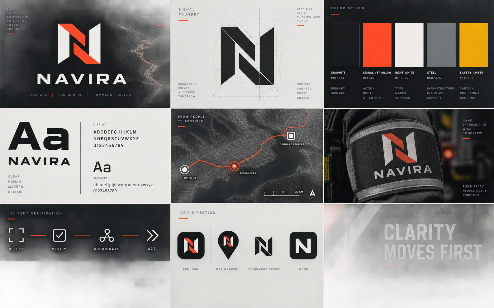

<p align="center">
  
</p>

# NAVIRA

**A disaster-response platform that connects civilians, emergency operators, and infrastructure testing in one system.**

Built by **Rishabh Mittal**.

[Open the live website](https://navira-rlzu.onrender.com) · [Run it locally](#run-it-locally) · [Free deployment guide](DEPLOYMENT.md)

> The free Render server sleeps when nobody is using it, so the first load can take about a minute.

## What is NAVIRA?

During a disaster, people usually have three basic questions:

1. Am I in danger?
2. Where should I go?
3. How do I get there?

Emergency teams have a harder version of the same problem. They need to know where the hazard is, who needs help, which teams are responding, and where limited resources should go.

I built NAVIRA to connect both sides. It uses real disaster and geographic data, checks risk using actual coordinates and available hazard geometry, helps civilians plan routes, and gives operators tools to manage the response. It also includes a 3D lab for testing how infrastructure may react to simulated disasters.

The main flow is:

```text
Disaster detected
      ↓
Verified data placed on the map
      ↓
People near the hazard are identified
      ↓
Routes, help requests, dispatch, and resources are connected
      ↓
Infrastructure can be tested against a matching scenario
```

## The three parts of NAVIRA

### 1. UNDERSTAND

- Interactive MapLibre world map with real zooming, panning, labels, and geographic proportions
- Current disaster records from **NASA EONET, GDACS, and USGS**
- Real event coordinates, geometry, timestamps, severity, status, and source links
- GDACS warning boundaries when the source provides them
- Verified event ledger and source timeline
- Location-based disaster analytics
- Event-linked news context, kept separate from verified agency facts
- Source health and freshness timestamps

### 2. PROTECT

#### Civilian side

- Separate civilian account and workspace
- **Near You** mode using browser location permission
- Nearby hazards sorted by real distance
- Deterministic checks against available hazard geometry
- Destination search using OpenStreetMap places
- Road routes calculated through OSRM
- Fastest and lower-exposure route comparison when the source data supports it
- Turn-by-turn style driving guidance and route monitoring
- Help requests that unlock only after a qualifying hazard check
- Camera and image upload for community incident reports
- Notifications when an operator verifies a nearby report

#### Operator side

- Separate government operator account and workspace
- People and hazards on one local map
- Review queue for civilian image reports
- Verified reports can become operator-confirmed map events
- Civilian help-request queue with status tracking
- Responder and team assignments
- Shared evacuation routes
- Resource inventory and allocation without allowing over-allocation
- Incident command context and linked operational records
- Human-readable audit trail for important actions
- Open511 road restrictions and OASIS CAP alerts where feeds are connected

### 3. TEST

- Search real mapped infrastructure by country, category, or address
- Import buildings, hospitals, bridges, schools, roads, airports, and other OpenStreetMap features
- Human review of every image before AI analysis
- Operator image uploads when open imagery is missing or incorrect
- AI-assisted visual description grounded in approved images and mapped geometry
- Procedural Three.js model generation
- Custom 3D modeler with object, face, edge, and vertex tools
- Earthquake, flood, and extreme-wind scenarios
- Animated deformation, water, wind, cracks, weak regions, and failure visualization
- Before, during, and after timeline controls
- Design A versus Design B scenario comparison
- Clear labels for mapped facts, operator assumptions, and simulated outputs

The simulation is a visual and heuristic prototype. It does not claim that a real structure is safe, unsafe, or guaranteed to fail.

## Data honesty

NAVIRA does not create fake disasters, coordinates, hazard boundaries, road closures, responders, or engineering results.

- Missing source information appears as **Data unavailable**.
- News reporting is labeled separately from agency data.
- A route is called lower exposure only when it actually intersects less verified hazard geometry than the fastest alternative.
- No road-closure record is treated as proof that a road is open.
- AI explains or describes retrieved evidence. It does not decide whether a disaster exists or where its boundary is.

## Quick walkthrough for judges

1. Open the landing page and see the live event feed.
2. Create a civilian account and open **Near You**.
3. Allow location access, inspect a nearby event, and try the safety flow.
4. Submit an image report from **Request Help**.
5. Create an operator account in another browser or private window.
6. Open **People + Hazards**, review the report, then inspect dispatch and resources.
7. Open the **Simulation Lab**, import a mapped structure or build one, and run a hazard scenario.

Some protection actions need a real event with usable source geometry near the shared location. NAVIRA intentionally keeps those actions locked when the evidence is not strong enough.

## Run it locally

### Requirements

- [Node.js 22](https://nodejs.org/)
- npm
- Internet access for live disaster, map, geocoding, routing, and imagery sources

### Setup

```bash
git clone https://github.com/rish497/Navira.git
cd Navira
npm install
```

Create a local environment file:

**Windows PowerShell**

```powershell
Copy-Item .env.example .env
```

**macOS or Linux**

```bash
cp .env.example .env
```

Add a long random value to `.env`:

```env
NAVIRA_AUTH_PEPPER=replace-this-with-a-long-random-secret
```

Then start the app:

```bash
npm run dev
```

Open [http://localhost:5173](http://localhost:5173).

Use the sign-up screen to create either a **Civilian** or **Government Operator** account. Operator accounts also ask for the organization name.

### Optional AI setup

The live maps, disaster feeds, authentication, location checks, and routing work without an AI key. AI is used for grounded route explanations and image-assisted 3D reconstruction.

```env
YOLO_AUTO_API_KEY=your-key
YOLO_AUTO_MODEL=qwen3.8-flash
YOLO_AUTO_VISION_MODEL=your-vision-model-if-different
```

Keep every API key server-side. Never add `VITE_` to secret names.

### Optional persistent storage

Local development automatically stores accounts and operational records inside `.navira-data`, which Git ignores.

For free Render hosting, NAVIRA can use Upstash:

```env
UPSTASH_REDIS_REST_URL=your-upstash-rest-url
UPSTASH_REDIS_REST_TOKEN=your-upstash-rest-token
NAVIRA_STORE_NAMESPACE=navira
```

## Useful commands

```bash
npm run dev      # Start the development server
npm run build    # Create a production build
npm start        # Run the built app on the configured PORT
```

## Main technologies

- React 19 and Vite
- MapLibre GL JS, OpenFreeMap, and OpenStreetMap
- Turf.js for deterministic geographic checks
- OSRM for road routing
- NASA EONET, GDACS, and USGS disaster feeds
- Open511 and OASIS CAP support
- Three.js and cannon-es for the simulation lab
- GSAP for interface motion
- Upstash Redis for free hosted persistence

## Project structure

```text
src/
├── server/              Live feeds, authentication, routing, and operations
├── simulation/          Three.js infrastructure simulation lab
├── App.jsx              Landing page and role-based workspaces
├── CivilianSafety.jsx   Near You, hazard checks, routes, and guidance
├── LiveMap.jsx          MapLibre disaster and operations map
└── OperationsViews.jsx  Requests, dispatch, resources, and evacuation
```

## Important note

NAVIRA is a hackathon prototype, not a certified emergency-warning or structural-engineering system. In a real emergency, people should follow official authorities, emergency services, road signs, and local instructions.

## Author

**Rishabh Mittal**

I made NAVIRA because disaster information should lead to a clear action, not just another alert on a screen.
